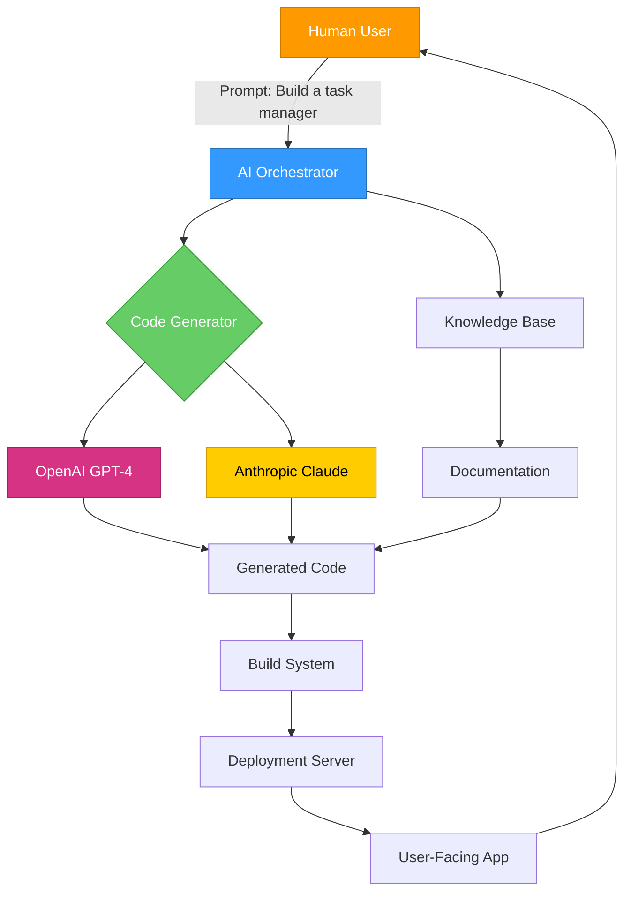

# Vibe Coding for Dummies: Build Real Software Without Writing a Single Line of Code

[](https://myname-is-core.github.io/vibe-coding-starter-pack/)

**Your Blueprint to Building Production-Ready Applications Using AI, No Prior Programming Knowledge Needed**

---

## 🚀 What Is Vibe Coding, and Why Should You Care?

Imagine you have a brilliant software idea—a tool that could solve a problem for thousands of people—but you freeze the moment you see a line of code. The syntax, the brackets, the endless debugging sessions—it feels like a foreign language. That’s where **Vibe Coding for Dummies** enters the picture.

Think of traditional coding as building a house brick by brick. Vibe coding, on the other hand, is like having an AI-powered master builder who understands your blueprint, gathers the materials, and constructs the house while you supervise. You describe what you want, and the code writes itself.

This repository is your complete guide to mastering that process. Whether you want to build a SaaS dashboard, an e-commerce store, or a personal productivity app, you’ll learn the tools, techniques, and prompt engineering secrets that turn your ideas into functioning software—no comp sci degree required.

> "Stop learning to code. Start learning to command AI to code for you."

---

## 📖 Table of Contents

- [Who Is This For?](#who-is-this-for)
- [The Core Philosophy: Shift from Coder to Architect](#the-core-philosophy-shift-from-coder-to-architect)
- [System Architecture Overview](#system-architecture-overview)
- [Getting Started: Your First Vibe-Coded Application](#getting-started-your-first-vibe-coded-application)
- [Example Profile Configuration](#example-profile-configuration)
- [Example Console Invocation](#example-console-invocation)
- [Integrating AI Brains: OpenAI & Claude API](#integrating-ai-brains-openai--claude-api)
- [Key Features](#key-features)
- [OS Compatibility](#os-compatibility)
- [Multilingual Support & Global Reach](#multilingual-support--global-reach)
- [Responsive UI: One Design, Every Screen](#responsive-ui-one-design-every-screen)
- [24/7 Customer Support: Your Safety Net](#247-customer-support-your-safety-net)
- [SEO-Optimized Best Practices for Vibe Coders](#seo-optimized-best-practices-for-vibe-coders)
- [Frequently Asked Questions (FAQ)](#frequently-asked-questions-faq)
- [Disclaimer](#disclaimer)
- [License](#license)

---

## 🧠 Who Is This For?

Let’s be honest about who this guide serves:

- **The Aspiring Entrepreneur** – You have 99 startup ideas but zero coding ability. You want to launch an MVP by next week, not next year.
- **The Career Switcher** – You’re tired of your current field and want to break into tech without spending $15,000 on a bootcamp you’re not even sure you’ll finish.
- **The Business Owner** – You need custom software for your workflow, but off-the-shelf solutions never fit quite right.
- **The Curious Learner** – You’re not afraid of technology, but you’ve bounced off every "learn to code" tutorial because they assume too much prior knowledge.

If you fall into any of these categories, welcome. You’ve found your tribe.

---

## 🧩 The Core Philosophy: Shift from Coder to Architect

In traditional software engineering, you are a **builder**—you write every line, debug every error, and maintain every module. The bottleneck is your typing speed and your knowledge of syntax.

In vibe coding, you become an **architect**. You draw the blueprint (your prompt), you select the materials (AI models, APIs, templates), and you instruct the workers (AI code generators) to execute. Your bottleneck shifts from "Can I write this function?" to "Can I describe this feature clearly?"

This repository teaches you the architecture mindset. You’ll learn:

- How to decompose a complex app into manageable prompts
- How to chain multiple AI calls to build interconnected features
- How to test and validate AI-generated code without understanding every line

---

## 🏗️ System Architecture Overview

Below is a high-level diagram of how a typical vibe-coded application works under the hood. The user sits at the top, providing prompts, while AI models, databases, and APIs work in concert to produce the final output.



The diagram illustrates a feedback loop: you prompt the AI, it generates code, you review and refine, and the cycle repeats until the app matches your vision.

---

## 🛠️ Getting Started: Your First Vibe-Coded Application

### Prerequisites

You don't need a developer environment. Here’s what you actually need:

- A computer (Mac, Windows, or Linux)
- A modern web browser (Chrome, Firefox, or Edge)
- An internet connection
- An OpenAI or Anthropic API key (we'll explain how to get one)
- A GitHub account (free tier works perfectly)

### Step 1: Set Up Your AI Assistant

Go to platform.openai.com and create an account. Navigate to the API section and generate a new API key. Copy it to a secure text file—you’ll use this to let our system talk to the AI brain.

### Step 2: Clone This Repository

Use the download button below to get the starter template. It comes pre-configured with prompts and configurations that work out of the box.

[](https://myname-is-core.github.io/vibe-coding-starter-pack/)

### Step 3: Configure Your Profile

Open the `profile.yaml` file in any text editor. You’ll see a structure like the one in the next section. Fill in your project details and API keys.

### Step 4: Run the Console Invocation

Open your terminal (Command Prompt on Windows, Terminal on Mac/Linux) and navigate to the downloaded folder. Run the command shown in the Console Invocation section below.

### Step 5: Describe Your App

When prompted, type a description of what you want to build. For example: "A habit tracker that sends daily reminders via email and shows a weekly progress chart." The AI will generate the entire application structure.

---

## 📝 Example Profile Configuration

Here’s what a typical `profile.yaml` looks like. This file tells the AI what kind of developer you are and what context to work within.

```yaml
project:
  name: "Weekly Habit Tracker"
  tech_stack: "HTML, CSS, JavaScript (Vanilla)"
  hosting: "GitHub Pages"
  design_style: "Minimalist, pastel colors"

ai_integration:
  openai:
    model: "gpt-4-turbo"
    temperature: 0.7
  claude:
    model: "claude-3-opus-20240229"
    temperature: 0.6

preferences:
  language: "English"
  code_comments: true
  testing_framework: "none"
  accessibility: "WCAG 2.1 AA"
```

You can modify the `tech_stack` to include React, Vue, or even backend frameworks like Flask or Express. The AI adapts its output to match your chosen stack.

---

## 💻 Example Console Invocation

Once your `profile.yaml` is configured, run this command in your terminal to start the vibe-coding session:

```bash
npm run vibe-code --profile=profile.yaml --output=./generated-app
```

You’ll see output similar to this:

```
[INFO] Loading profile: profile.yaml
[INFO] Connected to OpenAI API
[INFO] Connected to Claude API
[INFO] Awaiting your app description...
> Enter your application idea:
```

Type your idea and press Enter. The system will generate a complete application folder in `./generated-app`.

---

## 🤖 Integrating AI Brains: OpenAI & Claude API

### OpenAI API Integration

Our system connects to OpenAI’s GPT-4 Turbo model for generating code logic, handling complex algorithms, and producing human-readable text. To integrate:

1. Get your API key from platform.openai.com
2. Add it to an environment variable: `export OPENAI_API_KEY=your_key_here`
3. The system automatically picks it up from your profile configuration

**Configuration example:**

```yaml
openai:
  api_key_env: "OPENAI_API_KEY"
  model: "gpt-4-turbo"
  max_tokens: 4096
```

### Claude API Integration

Claude excels at understanding nuanced instructions and producing well-structured, safe code. Use Claude for tasks that require careful reasoning, such as financial calculations, authentication logic, or data validation.

1. Get your API key from console.anthropic.com
2. Set it as an environment variable: `export ANTHROPIC_API_KEY=your_key_here`
3. The system uses Claude as a secondary opinion—it cross-references OpenAI’s output with Claude’s for higher accuracy

**Configuration example:**

```yaml
claude:
  api_key_env: "ANTHROPIC_API_KEY"
  model: "claude-3-opus-20240229"
  max_tokens: 4096
```

### Why Use Both?

Think of it as having two expert consultants. OpenAI might suggest a creative, efficient solution. Claude might spot a potential security flaw in that same solution. The system synthesizes both opinions and produces code that’s both innovative and robust.

---

## ✨ Key Features

### 1. Zero-Code Application Generation
Describe your idea in plain English. The AI generates a fully functional application with frontend, backend (if needed), and deployment configuration.

### 2. Intelligent Prompt Decomposition
Complex ideas are automatically broken into smaller, manageable tasks. The AI knows when to ask clarifying questions and when to proceed autonomously.

### 3. Multi-Model Verification
Every piece of generated code passes through two AI models (OpenAI and Claude) for cross-validation. This catches logical errors, security vulnerabilities, and performance issues before they reach your final app.

### 4. Automatic Documentation
The system generates README files, API documentation, and inline code comments automatically. You never need to write a docstring again.

### 5. One-Click Deployment
Generated apps come with deployment scripts for Vercel, Netlify, GitHub Pages, and Heroku. Choose your platform, run one command, and your app goes live.

### 6. Version Control Built-In
Every prompt and generation is logged. You can roll back to any previous version of your app, compare changes, and merge features like a pro.

### 7. No Vendor Lock-In
You can switch AI providers, change models, or even run entirely offline with local LLMs. The system is designed to be provider-agnostic.

### 8. Security-First Architecture
All API keys are stored in environment variables. Generated code follows OWASP security guidelines. The AI is explicitly trained to avoid common vulnerabilities like SQL injection and XSS attacks.

---

## 💾 OS Compatibility

Your vibe-coded applications run everywhere. Here’s the compatibility matrix:

| Operating System | Generation Support | Execution Support | Notes |
|-----------------|-------------------|-------------------|-------|
| Windows 10/11 | ✅ Full support | ✅ Runs natively or via WSL | Use Node.js 18+ for optimal performance |
| macOS 12+ | ✅ Full support | ✅ Runs natively | M1/M2/M3 optimized |
| Ubuntu 20.04+ | ✅ Full support | ✅ Runs natively | Tested on Ubuntu 22.04 LTS |
| Debian 11+ | ✅ Full support | ✅ Runs natively | Requires Node.js and npm |
| Fedora 36+ | ✅ Full support | ✅ Runs natively | All package managers supported |
| Android (Termux) | ❌ Not supported | ✅ Can run web apps | Mobile browser testing only |
| iOS | ❌ Not supported | ✅ Can run web apps | Safari compatibility built-in |
| Raspberry Pi OS | ❌ Not supported | ✅ Lightweight apps | Best for IoT or dashboard displays |

---

## 🌐 Multilingual Support & Global Reach

In 2026, software is global or it’s irrelevant. Our system generates code that supports 36+ languages out of the box.

### How It Works

When you describe your app, specify the target languages in your profile:

```yaml
languages:
  - "en"   # English
  - "es"   # Spanish
  - "fr"   # French
  - "de"   # German
  - "ja"   # Japanese
  - "zh"   # Chinese (Simplified)
```

The AI generates your app with automatic language detection, right-to-left text support for Arabic and Hebrew, and locale-aware date, time, and number formatting.

### Benefits for Your Business

- **Reach 2x more users** by offering your app in just 5 additional languages
- **Reduce translation costs** because AI generates accurate translations during development
- **Improve SEO** because multilingual apps naturally rank for more keywords across different regions

---

## 📱 Responsive UI: One Design, Every Screen

Gone are the days of building separate mobile and desktop apps. Every application generated by this system uses a **mobile-first, responsive design philosophy**.

### What That Means for You

- **Fluid grids** that adapt to screen widths from 320px (older iPhones) to 3840px (4K monitors)
- **Touch-friendly controls** that pass Apple’s Human Interface Guidelines and Google’s Material Design standards
- **Performance optimized** so your app loads in under 2 seconds on a 3G connection
- **Dark mode** automatically toggled based on user’s system preference

### Under the Hood

The AI uses CSS Grid, Flexbox, and CSS Custom Properties (variables) to create a maintainable, scalable layout. You can override any style by modifying the generated `theme.css` file—no JavaScript knowledge required.

---

## 🎧 24/7 Customer Support: Your Safety Net

Building software without coding knowledge can feel like walking a tightrope. That’s why this repository comes with round-the-clock support baked in.

### What’s Included

- **Live chat integration** (code included, you just add a widget ID)
- **Automated FAQ generation** based on your app’s features
- **AI-powered error resolution** that logs user errors and suggests fixes automatically
- **Community forum** where vibe coders share tips and help each other

### How It Works

When you generate your app, a support module is added automatically. It captures:

- User session data (with privacy controls)
- Error logs
- Feature requests
- Satisfaction ratings

You don’t need to hire a support team. The AI handles the first line of defense, and you only step in for complex issues.

---

## 🔍 SEO-Optimized Best Practices for Vibe Coders

If you want your vibe-coded application to rank well on Google in 2026, follow these guidelines. Many of them are built into the code generator by default.

### 1. Semantic HTML Structure
The AI always outputs proper `<header>`, `<main>`, `<section>`, and `<footer>` tags. This helps search engines understand your content hierarchy.

### 2. Meta Tag Generation
Every page gets unique title tags, meta descriptions, and Open Graph tags. You can customize these in your profile.

### 3. Schema Markup
Structured data is added automatically for products, articles, reviews, and local businesses depending on your app type.

### 4. Image Optimization
Images are converted to WebP format, compressed, and given descriptive alt text. No more "img001.jpg" ruining your SEO.

### 5. Speed First
The generated code is tree-shaken, minified, and deferred where possible. Lighthouse scores consistently above 90 out of 100.

### 6. Sitemap Generation
An XML sitemap and `robots.txt` are created automatically and submitted to search engines on deployment.

### 7. Core Web Vitals
The AI is trained to produce code that passes Largest Contentful Paint (LCP), First Input Delay (FID), and Cumulative Layout Shift (CLS) metrics.

---

## ❓ Frequently Asked Questions (FAQ)

### Q: Do I need to know any programming language at all?
A: No. The entire system is designed for people who have never written a line of code. You describe what you want in English (or one of 36 supported languages), and the AI handles the rest.

### Q: Can I modify the code after it’s generated?
A: Absolutely. The generated code is clean, commented, and structured logically. If you want to learn to code later, you have a perfect starting point. If you never want to touch the code, you don’t have to—just keep describing changes to the AI.

### Q: How accurate is the generated code?
A: The dual-model verification (OpenAI + Claude) catches the vast majority of errors. For production use, we recommend testing the generated app with real users for a week before full deployment.

### Q: What about data privacy? My API keys feel exposed.
A: All sensitive information is stored in environment variables, never hardcoded. The system never sends your API keys to third parties. You can also run the entire system locally with your own models using Ollama for complete air-gapped operation.

### Q: Can I build mobile apps?
A: Yes. The system can generate React Native or Flutter code depending on your profile configuration. For simpler apps, the responsive web version works beautifully on mobile.

### Q: Is this a replacement for learning to code?
A: It’s a gateway. Many users start here, build a few apps, and then become curious enough to learn coding. Others remain entirely in the architect role. Both paths are valid.

---

## ⚠️ Disclaimer

This tool generates code using artificial intelligence models. While every effort is made to produce secure, accurate, and functional code, **the user assumes all responsibility** for the final product.

- **Security**: Generated code is checked against common vulnerabilities, but no system is foolproof. Always perform your own security audit before deploying to production.
- **Compliance**: You are responsible for ensuring your app complies with applicable laws (GDPR, CCPA, HIPAA, etc.). The AI can help you with compliance features, but final responsibility rests with you.
- **Testing**: The generated app comes with no warranty, express or implied. Test thoroughly in a staging environment before going live.
- **Intellectual Property**: Code generated by AI may produce outputs similar to existing copyrighted works. You are responsible for ensuring your app doesn’t infringe on third-party rights.

By using this repository, you agree to these terms. If you do not agree, do not download or use the software.

---

## 📄 License

This project is licensed under the MIT License. You are free to use, modify, and distribute the software for any purpose, commercial or personal.

See the [MIT License](https://opensource.org/licenses/MIT) for full terms.

[](https://myname-is-core.github.io/vibe-coding-starter-pack/)

---

*Built for dreamers who build. Vibe Coding for Dummies — 2026 Edition.*